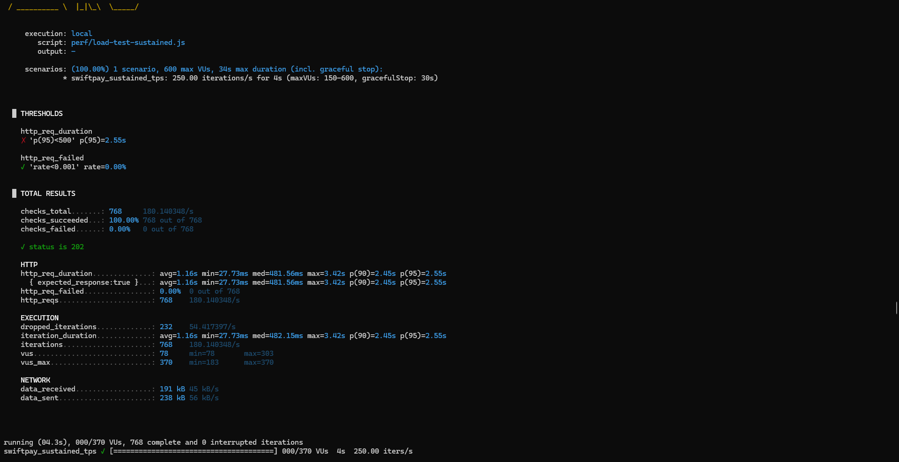
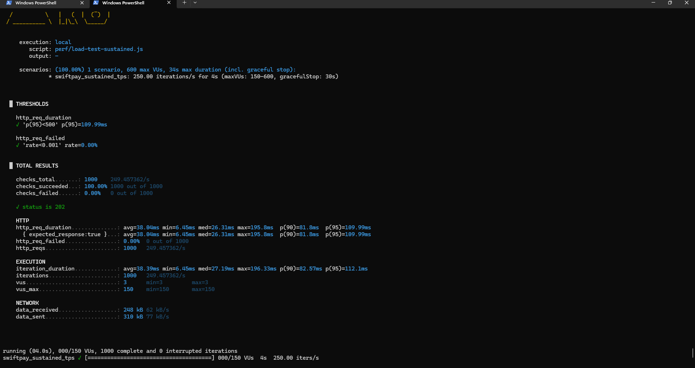
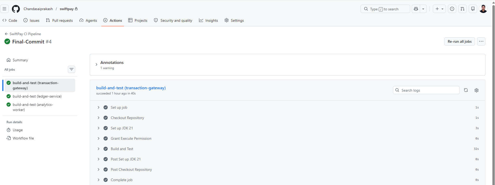

# ⚡ SwiftPay — Real-Time Event-Driven Payment Ledger

> A production-grade, distributed fintech platform for peer-to-peer payment processing — built with Java 21, Spring Boot 3, Apache Kafka, PostgreSQL, and Redis.

[](https://github.com/chandasaiprakash/swiftpay/actions/workflows/ci.yml)
[](https://openjdk.org/projects/jdk/21/)
[](https://spring.io/projects/spring-boot)
[](https://kafka.apache.org/)
[](https://www.postgresql.org/)
[](https://redis.io/)
[](https://www.docker.com/)
[](LICENSE)

---

## 📖 Table of Contents

- [Overview](#-overview)
- [Architecture](#-architecture)
- [Services](#-services)
- [Tech Stack](#-tech-stack)
- [Key Features](#-key-features)
- [Architectural Tradeoffs](#-architectural-tradeoffs)
- [Getting Started](#-getting-started)
- [REST API Reference](#-rest-api-reference)
- [Kafka Topics](#-kafka-topics)
- [Event Processing Outcomes](#-event-processing-outcomes)
- [Failure Handling](#-failure-handling)
- [Performance Testing](#-performance-testing)
- [Observability](#-observability)
- [Testing Strategy](#-testing-strategy)
- [CI/CD Pipeline](#-cicd-pipeline)
- [Kubernetes Readiness](#-kubernetes-readiness)
- [Future Improvements](#-future-improvements)

---

## 🏦 Overview

SwiftPay simulates the core of a real-world fintech payment infrastructure. It handles **asynchronous peer-to-peer transactions** at scale, enforcing:

- **Transactional consistency** — atomic debit/credit operations with rollback safety
- **Idempotency** — Redis-backed duplicate prevention within a configurable window
- **Event-driven resilience** — Kafka-based async processing with DLQ and retry handling
- **Production observability** — Prometheus metrics, Actuator health checks, structured logging
- **Sustained throughput** — load-tested at **250 TPS across 1 million transactions**

This system was built as part of a real-time payment ledger engineering challenge and is designed to reflect production engineering standards.

---

## 🏗 Architecture

```
┌──────────────────────────────────────────────────────────────────┐
│                            CLIENT                                │
└─────────────────────────────┬────────────────────────────────────┘
                              │ HTTP
                              ▼
┌──────────────────────────────────────────────────────────────────┐
│                    Transaction Gateway :8080                     │
│   • Accepts payment requests (REST)                              │
│   • Redis idempotency check (configurable window)                │
│   • Saves PENDING record to PostgreSQL                           │
│   • Publishes PaymentInitiated → Kafka                           │
│   • Exposes transaction query endpoints                          │
└─────────────────────────────┬────────────────────────────────────┘
                              │
                 Kafka Topic: payments.initiated
                              │
                              ▼
┌──────────────────────────────────────────────────────────────────┐
│                      Ledger Service :8081                        │
│   • Consumes PaymentInitiated events                             │
│   • Validates account balance                                    │
│   • Atomic debit/credit in DB transaction                        │
│   • Emits PaymentCompleted → payments.completed                  │
│   • Business failures → payments.failed                          │
│   • Infrastructure failures → payments.dlt (after retry)         │
└────────────┬─────────────────┬────────────────┬─────────────────┘
             │                 │                │
    payments.completed  payments.failed    payments.dlt
             │
             ▼
┌──────────────────────────────────────────────────────────────────┐
│                    Analytics Worker :8082                        │
│   • Consumes PaymentCompleted events                             │
│   • Aggregates real-time volume data for analytics               │
└──────────────────────────────────────────────────────────────────┘
             │                     │
             ▼                     ▼
       PostgreSQL               Redis
  (Transaction State)        (Idempotency)
```

---

## 🔧 Services

| Service | Port | Responsibility |
|---|---|---|
| `transaction-gateway` | `8080` | REST ingestion, idempotency, PENDING persistence, Kafka producer, transaction queries |
| `ledger-service` | `8081` | Kafka consumer, account validation, atomic balance mutation, status updates |
| `analytics-worker` | `8082` | Downstream consumer for payment analytics aggregation |

---

## 🛠 Tech Stack

| Layer | Technology |
|---|---|
| **Language** | Java 21 |
| **Framework** | Spring Boot 3, Spring Data JPA, Spring Kafka |
| **Messaging** | Apache Kafka |
| **Database** | PostgreSQL |
| **Cache** | Redis |
| **API Docs** | Swagger / OpenAPI |
| **Infrastructure** | Docker, Docker Compose |
| **Testing** | JUnit 5, Testcontainers |
| **Load Testing** | K6 + tshark (PCAP capture) |
| **Observability** | Prometheus, Spring Boot Actuator |
| **CI/CD** | GitHub Actions |

---

## ✨ Key Features

### ✅ Idempotent Payment APIs
Redis-backed idempotency keys prevent duplicate transaction processing. Any repeat request within the configured window returns the original result without re-executing the payment.

### ✅ Atomic Financial Operations
Ledger balance mutations execute within a **single database transaction** — ensuring atomic debit/credit, automatic rollback on failure, and zero partial-state corruption.

### ✅ Event-Driven Distributed Architecture
All inter-service communication is **fully asynchronous via Kafka**. No synchronous service-to-service HTTP calls — each service evolves and scales independently.

### ✅ Dead Letter Queue (DLQ)
After retry exhaustion, failed Kafka events are automatically routed to `payments.dlt` for inspection, replay, or alerting — with no silent data loss.

### ✅ Retry Mechanisms
Kafka consumers retry transient failures (DB outages, network blips) automatically before escalating to DLQ, providing built-in resilience without manual intervention.

### ✅ Layered, Modular Architecture
Each service follows strict layer separation: **Controller → Service → Repository → Messaging**, improving testability, maintainability, and separation of concerns.

### ✅ Production Observability
Prometheus metrics + Actuator endpoints expose JVM health, Kafka consumer lag, HikariCP pool stats, and HTTP throughput — all scrape-ready for Grafana.

---

## ⚖️ Architectural Tradeoffs

The current implementation makes a deliberate design choice:

- **`transaction-gateway`** owns transaction ingestion, idempotency enforcement, and transaction state persistence (including query endpoints)
- **`ledger-service`** focuses exclusively on account validation and balance mutation

This separation was intentionally chosen to:
- Simplify asynchronous workflow orchestration
- Centralize idempotent request handling in one service
- Reduce cross-service transactional complexity

### Evolution Path Toward CQRS

In a larger-scale production architecture, transaction query responsibilities would move into a **dedicated reporting or query service** following CQRS principles. A CDC pipeline or background sync process would replicate transactional data asynchronously into optimized read stores for:

| Workload | Approach |
|---|---|
| Transaction history queries | Dedicated read-optimized store |
| Analytics workloads | OLAP-friendly aggregation layer |
| Audit reporting | Append-only event log |
| Read-heavy access patterns | Redis read model or replica |

This would further decouple write-heavy transactional workflows from read-heavy reporting workloads, improving long-term scalability without sacrificing consistency.

---

## 🚀 Getting Started

### Prerequisites

- Docker & Docker Compose
- Java 21+
- Maven

### Start the Full Platform

```bash
docker-compose up -d
```

This spins up the complete ecosystem:

| Container | Description |
|---|---|
| `transaction-gateway` | Payment ingestion service |
| `ledger-service` | Core ledger processor |
| `analytics-worker` | Analytics consumer |
| `postgres` | Transaction persistence |
| `kafka` | Event broker |
| `redis` | Idempotency cache |

### Build & Run Tests

```bash
./mvnw clean test
```

### API Documentation (Swagger)

| Service | Swagger URL |
|---|---|
| Transaction Gateway | http://localhost:8080/swagger-ui/index.html |
| Ledger Service | http://localhost:8081/swagger-ui/index.html |
| Analytics Worker | http://localhost:8082/swagger-ui/index.html |

---

## 📡 REST API Reference

### Submit a Payment

```http
POST /v1/payments
Content-Type: application/json
Idempotency-Key: <unique-uuid>
```

**Request Body**
```json
{
  "senderId": 1001,
  "receiverId": 2005,
  "amount": 150.50,
  "currency": "USD"
}
```

**Response — `202 Accepted`**
```json
{
  "transactionId": "7a18dc7e-35f0-4a28-bd22-bd5760c5b284",
  "status": "PENDING",
  "message": "Payment request queued successfully"
}
```

---

### Get Transaction by ID

```http
GET /v1/payments/{transactionId}
```

**Response — `200 OK`**
```json
{
  "transactionId": "7a18dc7e-35f0-4a28-bd22-bd5760c5b284",
  "senderId": 1004,
  "receiverId": 2005,
  "amount": 150.50,
  "currency": "USD",
  "status": "COMPLETED",
  "createdAt": "2026-05-18T17:37:46.291",
  "updatedAt": "2026-05-18T17:37:48.102"
}
```

---

### Get User Transaction History

```http
GET /v1/payments/users/{userId}/transactions
```

**Response — `200 OK`**
```json
[
  {
    "transactionId": "8f7a1d10-c66c-4ff8-a8ff-30a0a6cb1d55",
    "senderId": 1001,
    "receiverId": 2005,
    "amount": 150.50,
    "currency": "USD",
    "status": "COMPLETED",
    "createdAt": "2026-05-20T10:22:31"
  },
  {
    "transactionId": "4dca9310-7db0-4716-b9d6-ef2af8a0c981",
    "senderId": 3002,
    "receiverId": 1001,
    "amount": 75.00,
    "currency": "USD",
    "status": "FAILED",
    "createdAt": "2026-05-20T09:11:02"
  }
]
```

All transaction query endpoints retrieve persisted state directly from PostgreSQL, supporting:
- Eventual consistency tracking
- Asynchronous workflow monitoring
- Payment verification and auditability

**Possible status values:** `PENDING` → `COMPLETED` / `FAILED`

---

## 📨 Kafka Topics

| Topic | Purpose |
|---|---|
| `payments.initiated` | Incoming payment requests |
| `payments.completed` | Successfully processed transactions |
| `payments.failed` | Business-level transaction failures |
| `payments.dlt` | Infrastructure/runtime failures after retry exhaustion |

---

## 🔀 Event Processing Outcomes

SwiftPay distinguishes between **business failures** and **infrastructure failures** — a deliberate design decision that improves operational clarity and failure classification.

### ✅ Successful Transactions

Successfully validated and processed payments are published to:

```
payments.completed
```

### ⚠️ Business Failures

Transactions that fail business validation rules are published to:

```
payments.failed
```

Examples of business failures:
- Insufficient funds
- Invalid account references
- Validation failures

These are **expected business outcomes**, not errors. They require no retry and should not pollute infrastructure failure queues.

### 💀 Dead Letter Queue (DLQ)

Unexpected runtime or infrastructure failures after retry exhaustion are redirected to:

```
payments.dlt
```

Examples of DLQ-bound failures:
- Database outages
- Kafka consumer crashes
- Serialization failures
- Unexpected processing exceptions

This separation delivers:

| Benefit | Detail |
|---|---|
| Operational debugging | Business vs infrastructure failures are immediately distinguishable |
| Failure classification | Each failure category has its own routing and handling strategy |
| Replay handling | DLQ contains only retriable infrastructure failures — safe to replay |
| Production observability | Separate topic metrics allow targeted alerting per failure type |

---

## 🛡 Failure Handling

### Insufficient Funds
The Ledger Service validates sender balance before transfer. On failure:
- Transaction marked `FAILED` in PostgreSQL
- `PaymentFailed` event published to `payments.failed` (business failure — no retry)
- `payments.dlt` is reserved for unexpected infrastructure failures only

### Kafka Outage
- Producer retries with configurable backoff
- Consumers retry failed records independently
- `PENDING` transactions persist safely in PostgreSQL during outage
- No data loss during transient broker failures

### Database Constraint Violations
- Operations execute inside transactional boundaries
- Automatic rollback on constraint violation
- Retry triggered before DLT escalation
- Atomicity and consistency guaranteed

---

## 📊 Performance Testing

### Load Test Configuration

| Parameter | Value |
|---|---|
| **Tool** | K6 |
| **Strategy** | Constant Arrival Rate |
| **Target TPS** | 250 TPS |
| **Total Transactions** | 1,000,000 |
| **Packet Capture** | PCAP via tshark |

### Bottleneck Identified & Resolved

#### ❌ Before Optimization

Single Kafka partition + single consumer thread caused immediate throughput collapse at 250 TPS:



| Metric | Value |
|---|---|
| p95 latency | **2.55s** — threshold FAILED ❌ |
| Avg latency | 1.16s |
| Dropped iterations | **232** |
| VUs escalated to | **370** (target: 150) |
| Throughput | Unstable — could not sustain 250 TPS |

#### ✅ After Optimization

Kafka partitions scaled to 6, consumer concurrency scaled to 6, batch ack mode enabled:



| Metric | Value |
|---|---|
| p95 latency | **109.99ms** — threshold PASSED ✅ |
| Avg latency | 38.04ms |
| Dropped iterations | **0** |
| VUs stabilized at | **150** (exactly at target) |
| Error rate | **0.00%** — 1000/1000 checks passed |
| Throughput | Stable **250 TPS** sustained |

#### Optimizations Applied

| Config | Before | After |
|---|---|---|
| Kafka Partitions | 1 | 6 |
| Consumer Concurrency | 1 | 6 |
| Ack Mode | Default | Batch |
| Poll Batch Size | Default | Tuned |

### Run Load Test

```bash
k6 run perf/load-test-sustained.js
```

### Packet Capture (Windows)

The full 1-million-transaction PCAP trace is available at `perf/swiftpay-loadtest.pcap`.

```powershell
& "C:\Program Files\Wireshark\tshark.exe" `
  -i \Device\NPF_Loopback `
  -f "tcp port 8080 or tcp port 9092 or tcp port 5432" `
  -s 512 `
  -w perf/swiftpay-loadtest.pcap
```

---

## 🔍 Observability

### Health Check

```http
GET /actuator/health
```

### Metrics Endpoints

| Endpoint | Purpose |
|---|---|
| `/actuator/health` | Liveness / readiness status |
| `/actuator/prometheus` | Prometheus scrape endpoint |
| `/actuator/metrics` | Available metric catalog |

Exposed metrics include:
- JVM memory, GC, and thread stats
- Kafka consumer group lag
- HikariCP connection pool utilization
- HTTP request rates and latencies
- Application health indicators

### Kafka Topic Observability

All four topics are visible and active in the Kafka UI, with messages flowing through `payments.initiated`, `payments.failed`, and `payments.dlt`:


Business failures routing correctly to `payments.failed` — 500 messages consumed, 149ms processing, confirming the business/infrastructure failure separation is working end-to-end:


Analytics worker consumer group holding **zero lag** across both `payments.completed` and `payments.failed` — confirming downstream processing keeps up at full throughput:


---

## 🧪 Testing Strategy

| Test Type | Technology | Scope |
|---|---|---|
| Unit Tests | JUnit 5 | Service and business logic |
| Repository Integration Tests | Testcontainers (PostgreSQL) | DB persistence and queries |
| Kafka Integration Tests | Testcontainers (Kafka) | Event production and consumption |

```bash
# Run all tests
./mvnw clean test
```

---

## ⚙️ CI/CD Pipeline

GitHub Actions workflow at `.github/workflows/ci.yml`:

```
Push / PR
    │
    ▼
Compile all services (Maven)
    │
    ▼
Run Unit + Integration Tests
    │
    ▼
Validate integration flows (Testcontainers)
    │
    ▼
Build Docker images
```

All three service pipelines passing on the final commit:



---

## ☸️ Kubernetes Readiness

SwiftPay services are designed to be Kubernetes-ready:

| Property | Status |
|---|---|
| Stateless service design | ✅ |
| Containerized via Docker | ✅ |
| Externalized configuration | ✅ |
| Health check endpoints | ✅ |
| Independent horizontal scaling | ✅ |

### Deploy to Kubernetes

```bash
# Apply all manifests
kubectl apply -f k8s/

# Verify pods are running
kubectl get pods -n swiftpay
```

**Planned K8s enhancements:**
- Helm charts for templated deployments
- Horizontal Pod Autoscaling (HPA)
- Rolling deployment strategy

---

## 🔮 Future Improvements

| Enhancement | Description |
|---|---|
| OpenTelemetry Tracing | Distributed trace propagation across all services |
| Grafana Dashboards | Pre-built dashboards for Kafka lag, payment throughput, error rates |
| Helm Charts | Templated Kubernetes deployments with environment-level overrides |
| Horizontal Pod Autoscaling | Dynamic scaling based on Kafka consumer lag metrics |
| Multi-Broker Kafka | Replicated Kafka cluster for broker-level fault tolerance |
| Saga Orchestration | Saga pattern for complex multi-step payment workflows |
| Redis Read Model | Optimized read-side caching for transaction history queries |
| Canary Deployments | Progressive traffic shifting for zero-downtime releases |

---

## 👤 Author

**Chanda Sai Prakash**  
Backend Engineer — Java · Spring Boot · Kafka · Distributed Systems

[](https://github.com/chandasaiprakash)

---

<p align="center">Built with ☕ Java 21 and a strong opinion about financial data consistency.</p>
