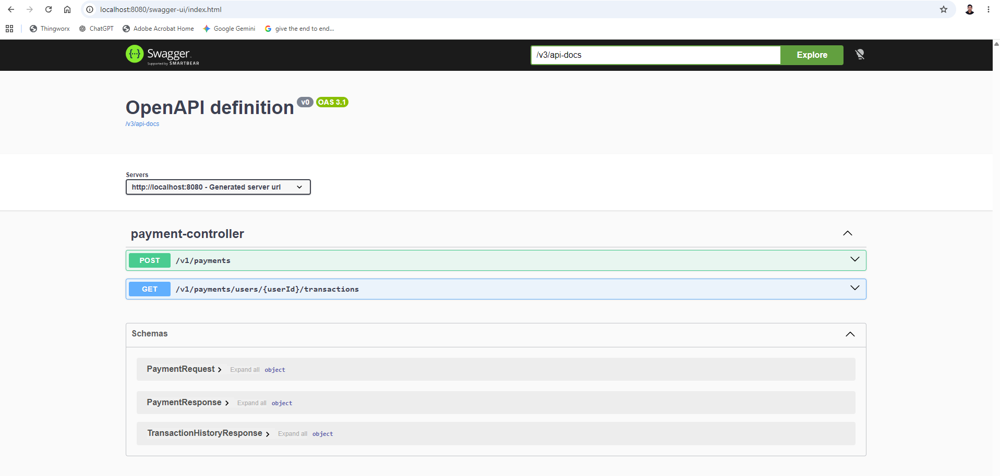
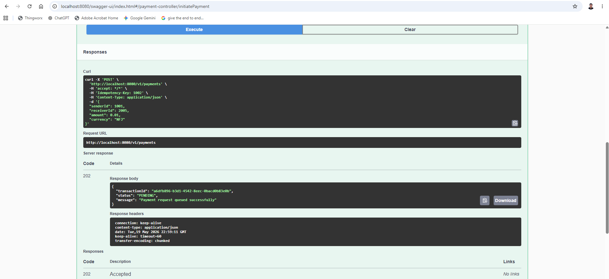
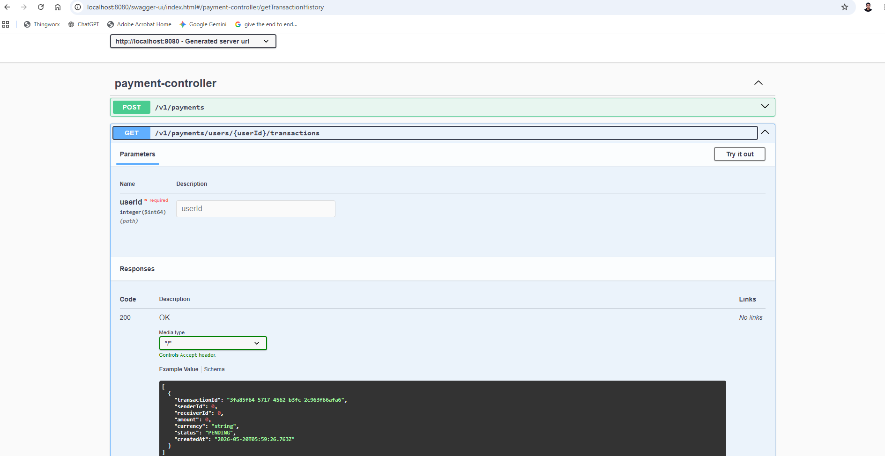
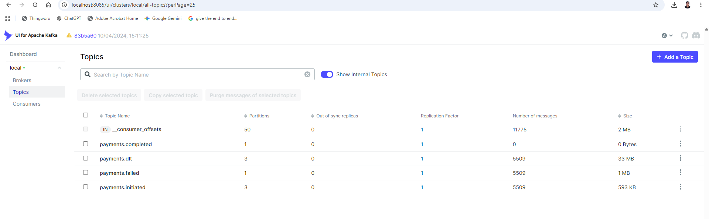
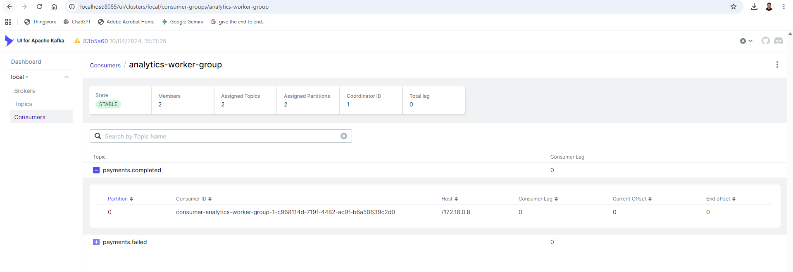
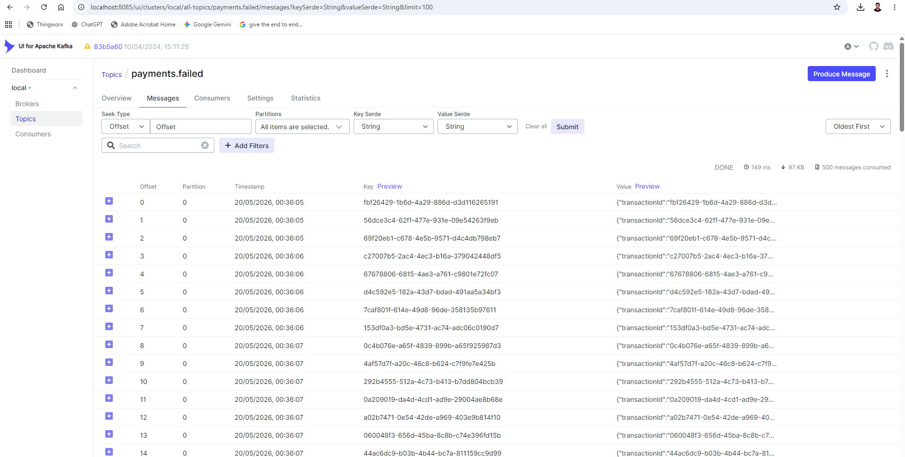
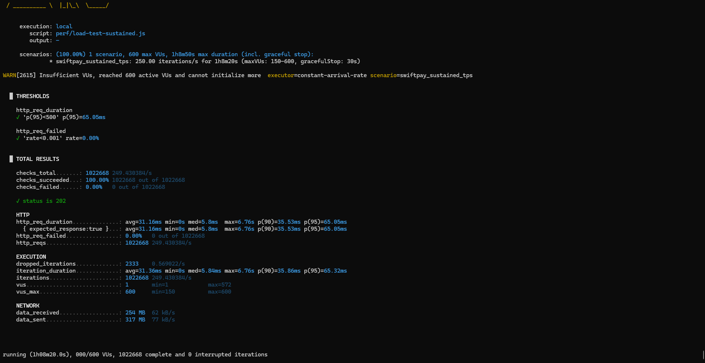
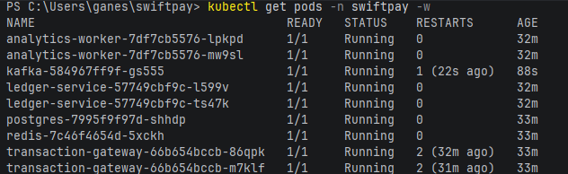

# ⚡ SwiftPay — Real-Time Event-Driven Payment Ledger

> A production-grade, distributed fintech platform for peer-to-peer payment processing — built with Java 21, Spring Boot 3, Apache Kafka, PostgreSQL, and Redis.

[](https://github.com/chandasaiprakash/swiftpay/actions/workflows/ci.yml)
[](https://openjdk.org/projects/jdk/21/)
[](https://spring.io/projects/spring-boot)
[](https://kafka.apache.org/)
[](https://www.postgresql.org/)
[](https://redis.io/)
[](https://www.docker.com/)

---

## 📖 Table of Contents

- [Overview](#-overview)
- [Architecture](#-architecture)
- [Services](#-services)
- [Tech Stack](#-tech-stack)
- [Key Features](#-key-features)
- [Architectural Tradeoffs](#-architectural-tradeoffs)
- [Getting Started](#-getting-started)
- [REST API Reference](#-rest-api-reference)
- [Request Validation](#-request-validation)
- [Error Handling](#-error-handling)
- [Kafka Topics](#-kafka-topics)
- [Consumer Groups](#-consumer-groups)
- [Event Processing Outcomes](#-event-processing-outcomes)
- [Failure Handling](#-failure-handling)
- [Database Schema](#-database-schema)
- [Observability & Metrics](#-observability--metrics)
- [Performance Testing](#-performance-testing)
- [Testing Strategy](#-testing-strategy)
- [CI/CD Pipeline](#-cicd-pipeline)
- [Kubernetes Readiness](#-kubernetes-readiness)
- [Future Improvements](#-future-improvements)

---

## 🏦 Overview

SwiftPay simulates the core of a real-world fintech payment infrastructure. It handles **asynchronous peer-to-peer transactions** at scale, enforcing:

- **Transactional consistency** — atomic debit/credit operations with rollback safety
- **Dual-layer idempotency** — Redis-backed API deduplication + DB-backed consumer idempotency
- **Event-driven resilience** — Kafka-based async processing with DLQ and retry handling
- **Production observability** — Prometheus metrics, Actuator health checks, structured logging
- **Sustained throughput** — load-tested at **250 TPS across 1 million transactions**

---

## 🏗 Architecture

```
┌──────────────────────────────────────────────────────────────────┐
│                            CLIENT                                │
└─────────────────────────────┬────────────────────────────────────┘
                              │ HTTP POST /v1/payments
                              │ (Idempotency-Key header required)
                              ▼
┌──────────────────────────────────────────────────────────────────┐
│                    Transaction Gateway :8080                     │
│   • Redis SETNX idempotency check (24h TTL)                      │
│   • Saves PENDING transaction + Outbox record (one @Transactional)│
│   • Returns 202 Accepted immediately                             │
│   • Scheduler (every 5s) publishes Outbox → Kafka               │
│   • Consumes payments.completed → marks transaction COMPLETED    │
│   • Consumes payments.failed   → marks transaction FAILED        │
│   • Exposes transaction history query endpoint                   │
└─────────────────────────────┬────────────────────────────────────┘
                              │
                 Kafka Topic: payments.initiated
                              │
                              ▼
┌──────────────────────────────────────────────────────────────────┐
│                      Ledger Service :8081                        │
│   • Checks ProcessedEvents table (DB-backed idempotency)         │
│   • Pessimistic lock both accounts (ORDER BY userId ASC)         │
│   • Validates sender balance                                     │
│   • Atomic debit/credit in single DB transaction                 │
│   • Saves ProcessedEvent record (same transaction)               │
│   • Success  → payments.completed                                │
│   • Business failure → payments.failed (no retry)               │
│   • Infra failure → retry 3x (2s interval) → payments.dlt       │
└────────────┬──────────────────────────────┬──────────────────────┘
             │                              │
   payments.completed              payments.failed
             │                              │
             └──────────────┬───────────────┘
                            │
         ┌──────────────────┴──────────────────┐
         ▼                                     ▼
Transaction Gateway                     Analytics Worker :8082
(marks COMPLETED / FAILED)        • Consumes payments.completed
                                    → increments completed count
                                    → accumulates payment volume
                                  • Consumes payments.failed
                                    → increments failed count
                                  • Exposes GET /v1/analytics
```

---

## 🔧 Services

| Service | Port | Responsibility |
|---|---|---|
| `transaction-gateway` | `8080` | REST ingestion, Redis idempotency, Outbox publishing, status tracking, transaction history queries |
| `ledger-service` | `8081` | Kafka consumer, DB idempotency, pessimistic locking, atomic balance mutation, event publishing |
| `analytics-worker` | `8082` | Downstream consumer for real-time payment analytics aggregation |

---

## 🛠 Tech Stack

| Layer | Technology | Version |
|---|---|---|
| **Language** | Java | 21 (Virtual Threads enabled on all 3 services) |
| **Framework** | Spring Boot | 3.5.14 |
| **Messaging** | Apache Kafka | Confluent 7.6.1 |
| **Database** | PostgreSQL | 16 |
| **Cache** | Redis | 7 |
| **ORM** | Spring Data JPA / Hibernate | — |
| **Schema Migration** | Flyway | — |
| **API Docs** | SpringDoc OpenAPI (Swagger UI) | 2.8.16 |
| **Infrastructure** | Docker, Docker Compose | — |
| **Container Orchestration** | Kubernetes (Docker Desktop) | — |
| **Testing** | JUnit 5, Testcontainers | — |
| **Load Testing** | K6 + tshark (PCAP capture) | — |
| **Observability** | Prometheus (port 9090), Spring Boot Actuator, Micrometer | — |
| **CI/CD** | GitHub Actions | — |

---

## ✨ Key Features

### ✅ Dual-Layer Idempotency

**API Layer (Redis):** `SETNX` with 24-hour TTL prevents duplicate payment requests from reaching the DB or Kafka. Any repeated request within the window returns `409 Conflict` instantly. The Redis key is deleted on transaction failure to prevent stale locks blocking legitimate retries.

**Consumer Layer (DB):** The Ledger Service checks `processed_events` before executing any account mutation. Guards against Kafka at-least-once redelivery causing double debits. The idempotency record and balance mutation are written in the same `@Transactional` — no partial state possible.

### ✅ Transactional Outbox Pattern

The gateway saves a `PaymentInitiatedEvent` as a JSONB row in `transaction_outbox` atomically with the transaction record. A `@Scheduled` background task polls every 5 seconds, publishes the top 100 PENDING events (ordered by `createdAt ASC`) to Kafka, then marks them PUBLISHED. Eliminates the dual-write problem entirely.

### ✅ Atomic Financial Operations

All account balance mutations in the Ledger Service execute within a single `@Transactional` — atomic debit and credit together. A `CHECK (balance >= 0)` constraint at the PostgreSQL level adds a safety net. Rollback is automatic on any failure.

### ✅ Pessimistic Locking with Deadlock Prevention

Both sender and receiver accounts are locked with `SELECT FOR UPDATE` (`PESSIMISTIC_WRITE`) before any balance read or write. Accounts are always locked in ascending `userId` order — preventing circular lock dependency and deadlocks under concurrent payment processing.

### ✅ Event-Driven, Fully Decoupled Architecture

All inter-service communication is asynchronous via Kafka. No synchronous HTTP calls between services. Each service fails, recovers, and scales independently.

### ✅ Business vs Infrastructure Failure Separation

Business failures (insufficient funds, account not found) are published to `payments.failed` — no retry, immediate routing. Infrastructure failures trigger 3 retries with 2-second intervals (`FixedBackOff(2000L, 3)`) before routing to `payments.dlt`. DLT events are safe to replay; `payments.failed` events are not.

### ✅ Production Observability

Custom Micrometer counters and timers registered across gateway and ledger-service: payment counters (initiated, completed, failed, duplicate), processing latency timers, and outbox publish health counters. All exposed via `/actuator/prometheus` for Prometheus scraping every 5 seconds.

### ✅ Tomcat Thread Pool Tuning

Both `transaction-gateway` and `ledger-service` configure Tomcat thread pools (`max: 200`, `min-spare: 20`) alongside Java 21 Virtual Threads and HikariCP pool tuning — all working together to maximize concurrent throughput.

---

## ⚖️ Architectural Tradeoffs

### Gateway Owns Transaction History
`transaction-gateway` owns both write (payment initiation) and read (history queries). The gateway already owns the `transactions` table, so query endpoints are a natural fit without duplicating data.

**Production evolution:** A dedicated CQRS query service would subscribe to outcome events and maintain a read-optimized store (Redis or Elasticsearch) — decoupling read and write throughput entirely.

| CQRS Workload | Approach |
|---|---|
| Transaction history queries | Dedicated read-optimized store |
| Analytics workloads | OLAP-friendly aggregation layer |
| Read-heavy access patterns | Redis read model or read replica |

### Shared PostgreSQL Instance
All three services share one PostgreSQL instance (same DB, separate tables). Acceptable for hackathon deployment. Production would use Database-per-Service with cross-service data access only through events.

### Outbox Scheduler Introduces ~5s Latency
The scheduler polls every 5 seconds, meaning events reach Kafka up to 5 seconds after the API responds 202. Acceptable because the payment flow is async by design. Production could use Debezium CDC for near-zero latency outbox publishing.

### `RuntimeException` as Non-Retryable Boundary
The ledger's `DefaultErrorHandler` marks all `RuntimeException` subclasses as non-retryable. Intentional — ensures business exceptions never pollute the retry path. The production improvement is a defined `BusinessException` hierarchy, leaving infrastructure exceptions retriable.

### Currency Hardcoded for Failed Payments in Analytics
`AnalyticsConsumer.consumeFailed()` increments the failed payments metric with `"USD"` hardcoded, because `PaymentFailedEvent` does not carry a currency field. This is a known gap — improving it requires enriching `PaymentFailedEvent` with currency from the original event.

---

## 🚀 Getting Started

### Prerequisites

- Docker & Docker Compose
- Java 21+
- Maven

### Start the Full Platform

```bash
# Development setup (includes Kafka UI)
docker-compose up -d

# OR: Full observability setup (includes Prometheus on port 9090)
cd infra && docker-compose up -d
```

The main `docker-compose.yml` spins up:

| Container | Port | Description |
|---|---|---|
| `transaction-gateway` | 8080 | Payment ingestion service |
| `ledger-service` | 8081 | Core ledger processor |
| `analytics-worker` | 8082 | Analytics consumer |
| `postgres` | 5432 | PostgreSQL 16 (Flyway migrations auto-applied on startup) |
| `kafka` | 9092 | Kafka broker |
| `zookeeper` | 2181 | Kafka coordination |
| `kafka-ui` | 8085 | Visual Kafka topic/message browser |
| `redis` | 6379 | Idempotency cache |

The `infra/docker-compose.yml` additionally includes **Prometheus** (port 9090) scraping all three services.

> **Note:** All three Spring Boot services depend on `postgres` health check (`pg_isready`) and will not start until the DB is healthy.

### Build & Run Tests

```bash
# Run from inside each service directory
./mvnw clean verify
```

### API Documentation (Swagger UI)

| Service | Swagger URL |
|---|---|
| Transaction Gateway | http://localhost:8080/swagger-ui/index.html |
| Ledger Service | http://localhost:8081/swagger-ui/index.html |
| Analytics Worker | http://localhost:8082/swagger-ui/index.html |



---

## 📡 REST API Reference

### Submit a Payment

```http
POST /v1/payments
Content-Type: application/json
Idempotency-Key: <unique-uuid>
```

> The `Idempotency-Key` header is **required**. Use a UUID generated client-side. The same key within 24 hours returns `409 Conflict`.

**Request Body**
```json
{
  "senderId": 1001,
  "receiverId": 2005,
  "amount": 100.00,
  "currency": "USD"
}
```

**Response — `202 Accepted`**
```json
{
  "transactionId": "7a18dc7e-35f0-4a28-bd22-bd5760c5b284",
  "status": "PENDING",
  "message": "Payment request queued successfully",
  "timestamp": "2026-05-20T10:22:31"
}
```



> The system responds immediately with `PENDING`. Processing is asynchronous — use the history endpoint to track final status.

---

### Get Transaction History

```http
GET /v1/payments/users/{userId}/transactions
```

Returns all transactions where the user is either the sender or receiver, ordered by `createdAt` descending.

**Response — `200 OK`**
```json
[
  {
    "transactionId": "8f7a1d10-c66c-4ff8-a8ff-30a0a6cb1d55",
    "senderId": 1001,
    "receiverId": 2005,
    "amount": 100.00,
    "currency": "USD",
    "status": "COMPLETED",
    "createdAt": "2026-05-20T10:22:31"
  },
  {
    "transactionId": "4dca9310-7db0-4716-b9d6-ef2af8a0c981",
    "senderId": 3001,
    "receiverId": 1001,
    "amount": 75.00,
    "currency": "USD",
    "status": "FAILED",
    "createdAt": "2026-05-20T09:11:02"
  }
]
```

**Possible status values:** `PENDING` → `COMPLETED` / `FAILED`



---

### Get Analytics Metrics

```http
GET /v1/analytics
```

Returns real-time payment metrics aggregated from the Kafka event stream.

**Response — `200 OK`**
```json
[
  { "metricName": "completed_payments", "metricValue": 874210, "currency": "USD", "updatedAt": "2026-05-20T10:22:45" },
  { "metricName": "failed_payments",    "metricValue": 125790, "currency": "USD", "updatedAt": "2026-05-20T10:22:44" },
  { "metricName": "payment_volume",     "metricValue": 87421000.00, "currency": "USD", "updatedAt": "2026-05-20T10:22:45" }
]
```

---

## 🛡 Request Validation

All fields on `POST /v1/payments` are validated with Jakarta Bean Validation (`spring-boot-starter-validation`):

| Field | Rule |
|---|---|
| `senderId` | `@NotNull` — required |
| `receiverId` | `@NotNull` — required |
| `amount` | `@NotNull` + `@DecimalMin("0.01")` — must be positive |
| `currency` | `@NotNull` + `@Pattern(regexp = "^[A-Z]{3}$")` — 3-character ISO 4217 code (e.g. `USD`) |

Invalid requests return `400 Bad Request` before any business logic executes.

---

## ⚠️ Error Handling

| Scenario | HTTP Status | Error Code |
|---|---|---|
| Duplicate `Idempotency-Key` | `409 Conflict` | `DUPLICATE_TRANSACTION` |
| Invalid request body (validation failure) | `400 Bad Request` | Spring validation error |

Error response shape for `409 Conflict`:
```json
{
  "timestamp": "2026-05-20T10:22:31",
  "errorCode": "DUPLICATE_TRANSACTION",
  "message": "Duplicate payment request detected"
}
```

---

## 📨 Kafka Topics

| Topic | Partitions | Replicas | Producer | Consumers |
|---|---|---|---|---|
| `payments.initiated` | 3 | 1 | transaction-gateway (Outbox scheduler) | ledger-service |
| `payments.completed` | 3 | 1 | ledger-service | transaction-gateway, analytics-worker |
| `payments.failed` | 3 | 1 | ledger-service | transaction-gateway, analytics-worker |
| `payments.dlt` | 3 | 1 | Spring DefaultErrorHandler | — (manual replay / alerting) |

All topics are auto-created by `transaction-gateway` on startup via `KafkaTopicConfig`. Messages are keyed by `transactionId.toString()` — guaranteeing all events for the same transaction land on the same partition, preserving per-transaction ordering.

### Producer Configuration (Transaction Gateway)

| Config | Value | Reason |
|---|---|---|
| `linger.ms` | 5 | Batches messages for 5ms — minimal latency tradeoff for throughput |
| `batch.size` | 32768 (32KB) | Larger batches reduce broker round-trips |
| `compression.type` | snappy | Fast compression, reduces network payload size |
| Key serializer | `StringSerializer` | TransactionId UUID as string |
| Value serializer | `JsonSerializer` | Jackson with `JavaTimeModule`, type headers disabled (`ADD_TYPE_INFO_HEADERS=false`) |



---

## 👥 Consumer Groups

| Consumer Group | Service | Topics Consumed | Concurrency |
|---|---|---|---|
| `ledger-service-group` | ledger-service | `payments.initiated` | 3 (set via `factory.setConcurrency(3)`) |
| `transaction-gateway-group-v1` | transaction-gateway | `payments.completed` | 3 (set via `concurrency = "3"` on `@KafkaListener`) |
| `transaction-gateway-group-v1` | transaction-gateway | `payments.failed` | 1 (default — no concurrency override) |
| `analytics-worker-group` | analytics-worker | `payments.completed` | 1 (default) |
| `analytics-worker-group` | analytics-worker | `payments.failed` | 1 (default) |

All consumers use **manual acknowledgment** (`AckMode.MANUAL`) — offsets are committed only after successful processing. If a service crashes mid-processing, the event is redelivered. Idempotency at each layer makes redelivery safe.



---

## 🔀 Event Processing Outcomes

SwiftPay distinguishes **business failures** from **infrastructure failures** — a deliberate design decision that improves operational clarity and failure classification.

### ✅ Success Path
```
payments.initiated
  → [Ledger validates + transfers]
  → payments.completed
       ├── transaction-gateway  (marks transaction COMPLETED)
       └── analytics-worker     (increments completed count + payment volume)
```

### ⚠️ Business Failure Path
```
payments.initiated
  → [Insufficient funds / Account not found]
  → payments.failed          (no retry — immediate routing)
       ├── transaction-gateway  (marks transaction FAILED)
       └── analytics-worker     (increments failed count)
```

### 💀 Infrastructure Failure Path
```
payments.initiated
  → [DB outage / unexpected exception]
  → Retry 1 after 2s
  → Retry 2 after 2s
  → Retry 3 after 2s
  → payments.dlt               (same partition as source — safe to replay)
```

| Failure Type | Route | Retriable |
|---|---|---|
| Insufficient funds | `payments.failed` | ❌ No |
| Account not found | `payments.failed` | ❌ No |
| Database outage | `payments.dlt` (after 3 retries) | ✅ Yes |
| Kafka consumer crash | Kafka redelivers (no ACK sent) | ✅ Yes |
| Serialization error | `payments.dlt` (after 3 retries) | ✅ Yes |



---

## 🗄 Database Schema

### transaction-gateway — `transactions`
```sql
CREATE TABLE transactions (
    transaction_id UUID          PRIMARY KEY,
    sender_id      BIGINT        NOT NULL,
    receiver_id    BIGINT        NOT NULL,
    amount         NUMERIC(19,2) NOT NULL,
    currency       VARCHAR(3)    NOT NULL,
    status         VARCHAR(20)   NOT NULL,   -- PENDING | COMPLETED | FAILED
    created_at     TIMESTAMP     NOT NULL,
    updated_at     TIMESTAMP     NOT NULL
);
CREATE INDEX idx_transactions_sender   ON transactions(sender_id);
CREATE INDEX idx_transactions_receiver ON transactions(receiver_id);
CREATE INDEX idx_transactions_status   ON transactions(status);
```

### transaction-gateway — `transaction_outbox`
```sql
CREATE TABLE transaction_outbox (
    id           UUID         PRIMARY KEY,
    aggregate_id UUID         NOT NULL,       -- transactionId
    event_type   VARCHAR(100) NOT NULL,       -- "PaymentInitiated"
    payload      JSONB        NOT NULL,       -- full serialized event
    status       VARCHAR(20)  NOT NULL,       -- PENDING | PUBLISHED
    created_at   TIMESTAMP    NOT NULL
);
CREATE INDEX idx_outbox_status ON transaction_outbox(status);
```

### ledger-service — `accounts`
```sql
CREATE TABLE accounts (
    user_id    BIGINT          PRIMARY KEY,
    balance    NUMERIC(19,2)   NOT NULL CHECK (balance >= 0),
    created_at TIMESTAMP       NOT NULL,
    updated_at TIMESTAMP       NOT NULL
);
-- Seed data (3 test accounts pre-loaded via Flyway)
INSERT INTO accounts VALUES (1001, 10000.00, NOW(), NOW());
INSERT INTO accounts VALUES (2005,  5000.00, NOW(), NOW());
INSERT INTO accounts VALUES (3001,  7000.00, NOW(), NOW());
```

### ledger-service — `processed_events`
```sql
CREATE TABLE processed_events (
    event_id     UUID      PRIMARY KEY,   -- transactionId used as idempotency key
    processed_at TIMESTAMP NOT NULL
);
CREATE INDEX idx_processed_events ON processed_events(processed_at);
```

### analytics-worker — `payment_analytics`
```sql
CREATE TABLE payment_analytics (
    id           BIGSERIAL       PRIMARY KEY,
    metric_name  VARCHAR(100)    NOT NULL,   -- completed_payments | failed_payments | payment_volume
    metric_value NUMERIC(19,2)   NOT NULL,
    currency     VARCHAR(10),
    updated_at   TIMESTAMP       NOT NULL
);
```

> All schemas are version-controlled via **Flyway** (`V1_create_*.sql`) and applied automatically on service startup.

> **Why `NUMERIC(19,2)` for all amounts?** Floating-point types (`double`, `float`) cannot represent many decimal values exactly. `BigDecimal` / `NUMERIC` provides exact decimal arithmetic — critical to avoid rounding errors compounding across millions of transactions.

---

## 🔍 Observability & Metrics

### Health & Actuator Endpoints

All three services expose:

| Endpoint | Purpose |
|---|---|
| `GET /actuator/health` | Liveness / readiness — DB, Kafka, Redis connection status |
| `GET /actuator/prometheus` | Prometheus scrape endpoint |
| `GET /actuator/metrics` | Full metric catalog |

### Custom Business Metrics (Micrometer)

| Metric | Service | Type | Description |
|---|---|---|---|
| `swiftpay_payment_initiated_total` | gateway | Counter | Total payment requests accepted |
| `swiftpay_payment_duplicate_total` | gateway | Counter | Duplicate requests rejected by Redis SETNX |
| `swiftpay_payment_initiation_latency` | gateway | Timer | Full initiation latency (Redis + DB + return) |
| `swiftpay_outbox_publish_success_total` | gateway | Counter | Outbox events successfully published to Kafka |
| `swiftpay_outbox_publish_failure_total` | gateway | Counter | Outbox publish failures per scheduler cycle |
| `swiftpay_payment_completed_total` | ledger | Counter | Payments successfully processed |
| `swiftpay_payment_failed_total` | ledger | Counter | Business failures (any route to payments.failed) |
| `swiftpay_insufficient_funds_total` | ledger | Counter | Specifically insufficient-funds failures |
| `swiftpay_duplicate_event_total` | ledger | Counter | Kafka redeliveries caught by DB idempotency |
| `swiftpay_payment_processing_latency` | ledger | Timer | Full payment processing latency |

### Prometheus

Configured in `infra/prometheus/prometheus.yml` — scrapes all three services every 5 seconds at `/actuator/prometheus`. Prometheus is included in `infra/docker-compose.yml` and runs on **port 9090**.

---

## 📊 Performance Testing

### Load Test Configuration

```javascript
// perf/load-test-sustained.js
scenarios: {
    swiftpay_sustained_tps: {
        executor: 'constant-arrival-rate',
        rate: 250,           // 250 new requests per second
        timeUnit: '1s',
        duration: '4100s',   // 4000s runtime = exactly 1,000,000 iterations
        preAllocatedVUs: 150,
        maxVUs: 600,
    }
},
thresholds: {
    http_req_failed:   ['rate<0.001'],   // 99.9% success rate required
    http_req_duration: ['p(95)<500'],    // p95 must be under 500ms
}
```

### Before Optimization — Bottleneck Identified

Single partition + single consumer thread → serial processing at ~40 events/sec. Gateway accepted 250 RPS but ledger couldn't keep up. Kafka consumer lag grew linearly, latency exploded, K6 spawned more VUs to compensate — positive feedback loop of degradation.


| Metric | Value |
|---|---|
| p95 latency | **2.55s** — threshold FAILED ❌ |
| Average latency | 1.16s |
| Dropped iterations | **232** |
| VUs escalated to | **370** (target: 150) |

### After Optimization — Results


| Metric | Value |
|---|---|
| p95 latency | **109.99ms** — threshold PASSED ✅ |
| Average latency | 38.04ms |
| Dropped iterations | **0** |
| VUs stable at | **150** (exactly at target) |
| Error rate | **0.00%** |
| Throughput | Stable **250 TPS** |



### Optimizations Applied

| Config | Before | After (committed) |
|---|---|---|
| Kafka partitions (all topics) | 1 | **3** |
| Consumer concurrency (ledger) | 1 | **3** |
| Consumer concurrency (gateway — completed) | 1 | **3** |
| Ack mode | Default (auto-commit) | **MANUAL** |
| HikariCP pool size (gateway + ledger) | 10 | **50** |
| HikariCP min-idle | default | **20** |
| HikariCP connection-timeout | default | **15,000ms** |
| Tomcat thread pool max | default | **200** |
| Tomcat thread pool min-spare | default | **20** |
| Java Virtual Threads | disabled | **enabled** (all 3 services) |
| Kafka producer `batch.size` | default | **32KB** |
| Kafka producer `linger.ms` | 0 | **5ms** |
| Kafka producer compression | none | **snappy** |

> **Note:** During load test tuning, up to 6 partitions and 6 concurrent consumers were tested. The final committed values of 3 partitions / 3 consumers achieved the 250 TPS target with headroom, balanced for the single-broker setup.

### Run Load Test

```bash
k6 run perf/load-test-sustained.js
```

### Packet Capture

```powershell
# Windows — capture all SwiftPay traffic
& "C:\Program Files\Wireshark\tshark.exe" `
  -i \Device\NPF_Loopback `
  -f "tcp port 8080 or tcp port 9092 or tcp port 5432" `
  -s 512 `
  -w perf/swiftpay-loadtest.pcap
```

---

## 🛡 Failure Handling

### Insufficient Funds
Ledger validates `sender.balance >= event.amount` before any mutation. On failure: publishes `PaymentFailed("Insufficient funds")` → `payments.failed`, throws `InsufficientFundsException`. Not retried — expected business outcome.

### Duplicate Payment Request (API Layer)
Redis `SETNX` returns `false` if the idempotency key already exists. Returns `409 Conflict` immediately. Redis key is deleted if the DB transaction subsequently fails — preventing stale locks.

### Duplicate Kafka Event (Consumer Layer)
`processedEventRepository.existsById(transactionId)` short-circuits processing before any account mutation. No side effects, no error, counter incremented.

### Kafka Outage
Outbox events remain as PENDING rows in PostgreSQL. Scheduler publishes them when Kafka recovers. No data loss.

### Database Outage (Ledger)
`DefaultErrorHandler` retries 3 times with 2-second intervals. After exhaustion: `DeadLetterPublishingRecoverer` routes to `payments.dlt` on the same partition.

### Service Crash Mid-Processing
No manual ACK sent → Kafka redelivers after consumer group rebalance. `processed_events` table prevents double processing.

### Serialization Failure (Gateway)
`JsonProcessingException` caught in `PaymentService` — Redis key deleted, DB transaction rolled back. Client can safely retry with same idempotency key.

---

## 🧪 Testing Strategy

| Test | Class | Service | Stack |
|---|---|---|---|
| Repository Integration | `TransactionRepositoryIntegrationTest` | transaction-gateway | `@DataJpaTest` + Testcontainers PostgreSQL 16 |
| Kafka Integration | `KafkaIntegrationTest` | ledger-service | Testcontainers Confluent Kafka 7.6.1 |

### `TransactionRepositoryIntegrationTest`

`@DataJpaTest` — boots only the JPA layer (no web context, no Kafka, no Redis). `@AutoConfigureTestDatabase(replace=NONE)` prevents Spring substituting H2. `@DynamicPropertySource` injects the Testcontainer's dynamic JDBC URL. Flyway disabled; DDL set to `create-drop` so Hibernate manages the schema directly.

**Asserts:** `TransactionEntity` is saved with a generated UUID and retrieved with `status = PENDING`.

### `KafkaIntegrationTest`

Spins up a real Kafka broker via `KafkaContainer`. Produces a `PaymentCompletedEvent` using a raw `KafkaTemplate`. Consumes it using a typed `KafkaConsumer<String, PaymentCompletedEvent>` with `JsonDeserializer` — testing the serialization/deserialization contract independently of Spring's listener infrastructure.

**Asserts:** Message received, `currency == "USD"`, `amount` equals `150.50` (using `isEqualByComparingTo` for `BigDecimal` precision correctness).

```bash
./mvnw clean verify   # run from inside each service directory
```

---

## ⚙️ CI/CD Pipeline

`.github/workflows/ci.yml` — triggers on push to `master` and PRs to `main` / `develop`:

```
Push / PR
    │
    ▼
Matrix strategy: 3 jobs run in parallel
[transaction-gateway]  [ledger-service]  [analytics-worker]
    │
    ▼
Checkout → JDK 21 (Temurin) → Maven cache
    │
    ▼
./mvnw clean verify
(compiles + unit tests + integration tests via Testcontainers)
    │
    ▼
docker build -t {service}:latest .
```

All three service pipelines passing:


---

## ☸️ Kubernetes Readiness

Deployed and validated locally using Docker Desktop Kubernetes.

```bash
kubectl apply -f k8s/
kubectl get pods -n swiftpay
```

### K8s Resource Summary

| Resource | Details |
|---|---|
| Namespace | `swiftpay` — all resources isolated |
| transaction-gateway | Deployment (2 replicas) + LoadBalancer Service |
| ledger-service | Deployment (2 replicas) + LoadBalancer Service |
| analytics-worker | Deployment + Service |
| Kafka | Deployment + Service (port 9092) |
| PostgreSQL | Deployment + PersistentVolumeClaim + Service |
| Redis | Deployment + Service (port 6379) |
| ConfigMap | `swiftpay-config` — Kafka bootstrap servers, DB host/port, Redis host/port |
| Secret | `swiftpay-secret` — PostgreSQL credentials (base64-encoded) |

### K8s Readiness Checklist

| Property | Status |
|---|---|
| Stateless microservice design | ✅ |
| Docker containerization | ✅ |
| Externalized configuration (ConfigMap + Secret) | ✅ |
| Kubernetes Deployments | ✅ |
| Kubernetes Services | ✅ |
| Namespace isolation | ✅ |
| Multi-replica deployments (gateway + ledger) | ✅ |
| Health check endpoints (`/actuator/health`) | ✅ |
| Independent horizontal scaling per service | ✅ |

All pods running with 0 restarts:



**Planned K8s enhancements:** Helm charts, KEDA-based HPA on Kafka consumer lag, rolling deployment with readiness probes, liveness probe configuration.

---

## 🔮 Future Improvements

| Enhancement | Description |
|---|---|
| **OpenTelemetry Tracing** | Propagate `traceId` through Kafka message headers to correlate a single payment across all three services in one distributed trace (Jaeger / Zipkin) |
| **Grafana Dashboards** | Pre-built dashboards for Kafka consumer lag, payment throughput, p95 latency, and error rates — using existing Prometheus metrics |
| **Helm Charts** | Parameterized Kubernetes deployments with environment-level value overrides (dev / staging / prod) |
| **KEDA-based HPA** | Auto-scale `ledger-service` pods based on `payments.initiated` consumer lag — spin up on lag growth, scale down when clear |
| **Multi-Broker Kafka** | 3-broker cluster with `replication.factor: 3` and `min.insync.replicas: 2` for broker-level fault tolerance |
| **Saga Orchestration** | Multi-step payment workflow (fraud check → reserve → debit → credit → notify) with compensating transactions |
| **CQRS Query Service** | Dedicated read service subscribing to outcome events, maintaining a Redis or Elasticsearch read model for transaction history |
| **Exception Hierarchy** | Replace broad `RuntimeException` non-retry rule with `BusinessException extends RuntimeException` — leaving infrastructure exceptions retriable |
| **Currency in Failed Events** | Carry currency through `PaymentFailedEvent` so analytics worker segments failed payments by currency correctly |
| **API Gateway / Rate Limiting** | Kong or Spring Cloud Gateway in front of transaction-gateway for per-client rate limiting, JWT auth, and SSL termination |

---

## 👤 Author

**Chanda Sai Prakash**
Backend Engineer — Java · Spring Boot · Kafka · Distributed Systems

[](https://github.com/chandasaiprakash)

---

<p align="center">Built with ☕ Java 21 and a strong opinion about financial data consistency.</p>
